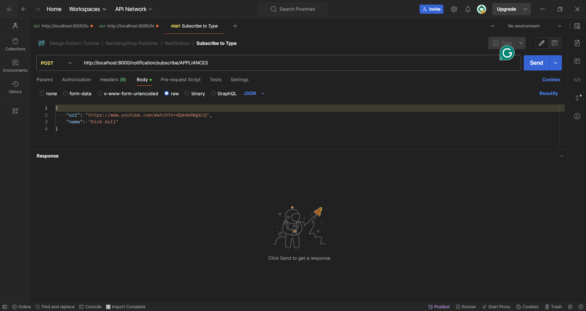
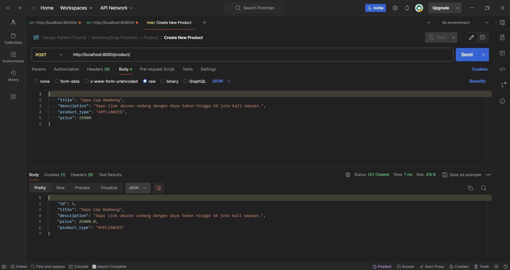
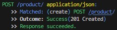

# BambangShop Publisher App
Tutorial and Example for Advanced Programming 2024 - Faculty of Computer Science, Universitas Indonesia

---

## About this Project
In this repository, we have provided you a REST (REpresentational State Transfer) API project using Rocket web framework.

This project consists of four modules:
1.  `controller`: this module contains handler functions used to receive request and send responses.
    In Model-View-Controller (MVC) pattern, this is the Controller part.
2.  `model`: this module contains structs that serve as data containers.
    In MVC pattern, this is the Model part.
3.  `service`: this module contains structs with business logic methods.
    In MVC pattern, this is also the Model part.
4.  `repository`: this module contains structs that serve as databases and methods to access the databases.
    You can use methods of the struct to get list of objects, or operating an object (create, read, update, delete).

This repository provides a basic functionality that makes BambangShop work: ability to create, read, and delete `Product`s.
This repository already contains a functioning `Product` model, repository, service, and controllers that you can try right away.

As this is an Observer Design Pattern tutorial repository, you need to implement another feature: `Notification`.
This feature will notify creation, promotion, and deletion of a product, to external subscribers that are interested of a certain product type.
The subscribers are another Rocket instances, so the notification will be sent using HTTP POST request to each subscriber's `receive notification` address.

## API Documentations

You can download the Postman Collection JSON here: https://ristek.link/AdvProgWeek7Postman

After you download the Postman Collection, you can try the endpoints inside "BambangShop Publisher" folder.
This Postman collection also contains endpoints that you need to implement later on (the `Notification` feature).

Postman is an installable client that you can use to test web endpoints using HTTP request.
You can also make automated functional testing scripts for REST API projects using this client.
You can install Postman via this website: https://www.postman.com/downloads/

## How to Run in Development Environment
1.  Set up environment variables first by creating `.env` file.
    Here is the example of `.env` file:
    ```bash
    APP_INSTANCE_ROOT_URL="http://localhost:8000"
    ```
    Here are the details of each environment variable:
    | variable              | type   | description                                                |
    |-----------------------|--------|------------------------------------------------------------|
    | APP_INSTANCE_ROOT_URL | string | URL address where this publisher instance can be accessed. |
2.  Use `cargo run` to run this app.
    (You might want to use `cargo check` if you only need to verify your work without running the app.)

## Mandatory Checklists (Publisher)
-   [✔️] Clone https://gitlab.com/ichlaffterlalu/bambangshop to a new repository.
-   **STAGE 1: Implement models and repositories**
    -   [✔️] Commit: `Create Subscriber model struct.`
    -   [✔️] Commit: `Create Notification model struct.`
    -   [✔️] Commit: `Create Subscriber database and Subscriber repository struct skeleton.`
    -   [✔️] Commit: `Implement add function in Subscriber repository.`
    -   [✔️] Commit: `Implement list_all function in Subscriber repository.`
    -   [✔️] Commit: `Implement delete function in Subscriber repository.`
    -   [✔️] Write answers of your learning module's "Reflection Publisher-1" questions in this README.
-   **STAGE 2: Implement services and controllers**
    -   [✔️] Commit: `Create Notification service struct skeleton.`
    -   [✔️] Commit: `Implement subscribe function in Notification service.`
    -   [✔️] Commit: `Implement subscribe function in Notification controller.`
    -   [✔️] Commit: `Implement unsubscribe function in Notification service.`
    -   [✔️] Commit: `Implement unsubscribe function in Notification controller.`
    -   [✔️] Write answers of your learning module's "Reflection Publisher-2" questions in this README.
-   **STAGE 3: Implement notification mechanism**
    -   [✔️] Commit: `Implement update method in Subscriber model to send notification HTTP requests.`
    -   [✔️] Commit: `Implement notify function in Notification service to notify each Subscriber.`
    -   [✔️] Commit: `Implement publish function in Program service and Program controller.`
    -   [✔️] Commit: `Edit Product service methods to call notify after create/delete.`
    -   [✔️] Write answers of your learning module's "Reflection Publisher-3" questions in this README.

## Your Reflections
This is the place for you to write reflections:

### Mandatory (Publisher) Reflections

#### Reflection Publisher-1
1. In the Observer pattern, the Subscriber interface (or trait in Rust) serves to define the standard methods that each concrete observer must implement to receive updates from the subject. This approach supports the decoupling of the subject's implementation from its observers, enabling more flexible and maintainable code by adhering to the open/closed principle. In the BambangShop case, implementing the Subscriber as a trait rather than just a struct allows the application to potentially handle different types of subscribers that may require different implementations for handling notifications. Thus, despite having a single Model struct, utilizing a trait for Subscriber is beneficial for maintaining the scalability and flexibility of the application's design.

2. Using a Vec for storing unique identifiers such as 'id' and 'url' can be inefficient, particularly as the data grows, because checking for uniqueness would require iterating through the entire list, which is time-consuming and not scalable (O(n) complexity). In contrast, using a DashMap, a thread-safe, high-performance concurrent map, allows for much faster lookups, insertions, and deletions (close to O(1) complexity), which is crucial for maintaining performance as the number of subscribers grows. DashMap provides a more efficient and appropriate solution for handling unique values in a concurrent environment typical in web applications like BambangShop. 

3. The Singleton pattern ensures that a class has only one instance and provides a global point of access to it. However, merely implementing a Singleton does not inherently solve the issue of thread safety in concurrent environments. While Rust’s type system and ownership rules help enforce safety, for concurrent access to shared data like the List of Subscribers, using a thread-safe data structure like DashMap is essential. DashMap provides the necessary concurrency mechanisms out-of-the-box, making it a superior choice over implementing a Singleton pattern, which would still require additional mechanisms to manage thread-safe access and data mutations efficiently. Therefore, continuing to use DashMap is recommended for maintaining the thread safety and performance of the application.

#### Reflection Publisher-2
1. In the MVC pattern, the Model component indeed encapsulates both data and behavior that manipulates the data. However, in more complex applications, it is advantageous to further separate concerns to achieve a cleaner, more maintainable, and scalable architecture. The "Repository" pattern is used to separate data access logic and business logic, allowing the data access mechanisms to change independently of the rest of the code. This helps in maintaining the code dealing with data sources, like databases or external services, isolated from the business logic layer. On the other hand, the "Service" layer is used to encapsulate the business logic of the application, acting as a bridge between the Controllers and Repositories. This separation enhances modularity, reduces complexity, and increases the reusability of the code, making it easier to manage as the application grows and evolves.

2. If only the Model is used without distinct Service and Repository layers, each Model would need to handle its own data storage, retrieval, and business logic. This approach would significantly increase the complexity of the Model classes as they would be managing too many responsibilities. For instance, the Subscriber Model would need methods to subscribe, unsubscribe, handle notifications, and directly interact with the database for CRUD operations. This increases the risk of code duplication, as similar data-handling logic might be needed in different models. It also makes the system less flexible to changes, as modifications in the database layer or business rules might require extensive changes across multiple models, thus violating the Single Responsibility Principle and making the system harder to maintain and scale.

3. Postman is a powerful tool for API development and testing, allowing developers to send requests to web servers and view responses. Using Postman, developers can easily test APIs by creating collections of requests, specifying various HTTP methods, headers, and body data. Features like environment variables enable developers to switch between different development or production environments quickly. The ability to automate tests and integrate with continuous integration tools can significantly enhance the efficiency of developing and testing APIs. For the group project, features like sharing collections and collaborative workspaces are particularly beneficial, enabling team members to work together seamlessly on API development. 



#### Reflection Publisher-3
1. In this tutorial, we are implementing the Push model of the Observer pattern. This is evident from the fact that the update method in the Subscriber model is designed to send notifications to the Subscriber using an HTTP POST request actively. The notify function in the NotificationService prepares the notification payload and proactively sends (pushes) this information to each subscriber by calling the update method for each one. This approach contrasts with the Pull model, where the Subscriber would periodically check or 'pull' for updates from a central publisher or source.

2. If we were to use the Pull model in this tutorial case, one advantage would be that subscribers could manage when and how often they check for updates, potentially reducing unnecessary traffic if there are no new updates to be pulled. This could also distribute network load more evenly over time instead of spikes during push notifications.

However, the disadvantages might include increased complexity on the client-side, as each Subscriber would need to implement its own scheduling mechanism to check for updates. It may also result in delays in receiving updates since the pulling would happen at predetermined intervals, not in real-time. This model can also lead to increased resource utilization on the server side if many subscribers are frequently polling for updates, even when there are none.

3. Not using multi-threading in the notification process would mean that the program would handle all notifications sequentially on a single thread. This could lead to several issues, especially as the number of subscribers grows. First, there could be a significant delay in the delivery of notifications to subscribers, as each notification must wait for the previous one to complete. In a high-load scenario, this could result in a backlog of notifications, leading to performance bottlenecks.

Moreover, the entire notification process would be vulnerable to the failure of individual notifications. If sending a notification to one subscriber fails or takes a long time due to network issues, it could hold up the notifications for all subsequent subscribers. This could also negatively impact the responsiveness of the entire application, as the single thread handling notifications might be unable to process other tasks in a timely manner.

Therefore, utilizing multi-threading allows the notification process to be more scalable and resilient. Notifications to subscribers can be processed in parallel, reducing the time taken to notify all subscribers and isolating issues so that a problem with one notification does not affect others.



